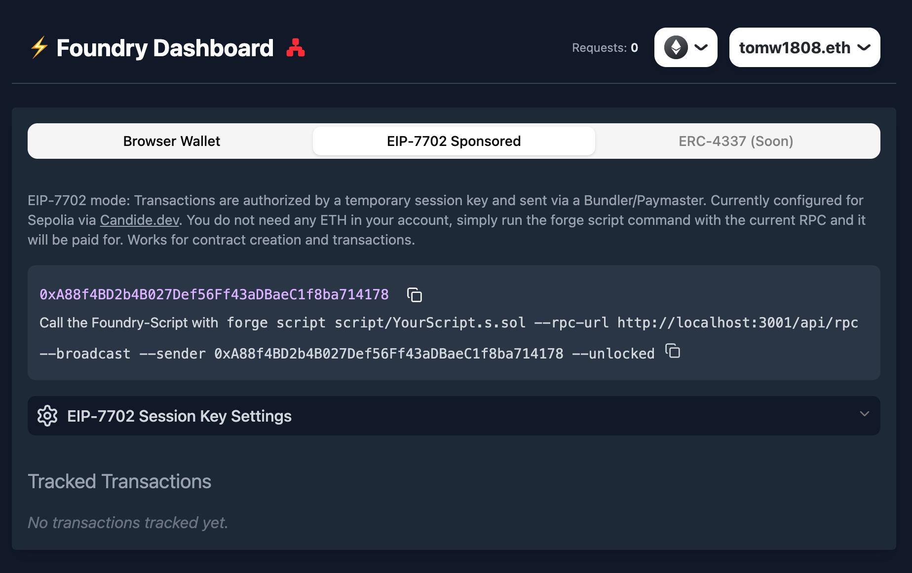

# Foundry Dashboard ⚡️🦊



**Bring the power of browser wallets (and gasless Sepolia transactions via EIP-7702) to your Foundry workflow.**

*(Note: This is an unofficial community project inspired by Truffle Dashboard and is not affiliated with the official Foundry team. This is an early preview.)*

Ever missed the convenience of Truffle Dashboard when working with Foundry? Wished you could use your familiar browser wallet to sign transactions triggered by `forge script --broadcast` without juggling private keys? Or better yet, deploy and test on Sepolia *without needing any Sepolia ETH*?

Foundry Dashboard aims to bridge these gaps. It's a lightweight, local tool that acts as a secure intermediary between your Foundry scripts and your browser wallet, and now also integrates EIP-7702 for sponsored transactions on Sepolia via [Candide.dev's infrastructure](https://candide.dev).

## The Problem Solved 🧩

Foundry is an incredibly powerful toolkit for smart contract development. However, interacting with deployed contracts or broadcasting transactions via `forge script` often requires handling private keys directly or using hardware wallets via specific flags. While secure, this can sometimes slow down the rapid iteration loop, especially during testing and deployment phases on testnets or even local nodes like Anvil.

Tools like Truffle Dashboard provided a neat solution by letting developers use their browser wallets (already configured with accounts, nonces managed, etc.) to sign and send transactions initiated from the command line. Forge Dashboard brings this crucial piece of developer experience to the Foundry ecosystem.

## How it Works ⚙️

Foundry Dashboard runs a small local server that does three main things:

1.  **Listens for JSON-RPC Requests:** It exposes a local RPC endpoint (e.g., `http://localhost:3001/api/rpc`). You point `forge script` or other tools to this endpoint using the `--rpc-url` flag.
2.  **Decodes Transaction Data:** When run within a Foundry project context, the server reads your compiled contract artifacts (`./out` directory) and attempts to decode `eth_sendTransaction` requests into human-readable function calls or contract deployments.
3.  **Communicates with a Frontend:** It serves a simple web interface that connects to your browser wallet (MetaMask, etc.) via WebSocket.

When `forge script` needs to send a transaction (`eth_sendTransaction`), the flow is:

1.  `forge script` sends the request to the Foundry Dashboard server (`/api/rpc`).
2.  The server attempts to decode the transaction data using the ABIs found in the specified project path.
3.  The server pushes the request (including any decoded information) via WebSocket to the connected web frontend.
4.  The frontend displays the request details and offers signing options:
    *   **Browser Wallet Mode:** Prompts you to approve or reject in your connected browser wallet (e.g., MetaMask). The signed transaction is sent back.
    *   **EIP-7702 Mode (Sepolia):** Uses a local session key to authorize the transaction. The dashboard then constructs an EIP-7702 UserOperation, sends it to Candide.dev's bundler and paymaster infrastructure, allowing for gasless transactions on Sepolia (you don't need Sepolia ETH in your session account).
5.  The frontend sends the signed transaction (or UserOperation hash and eventual transaction hash for EIP-7702) or rejection error back to the local server via WebSocket.
6.  The server relays the JSON-RPC response back to the waiting `forge script` process.

Other standard RPC calls (`eth_chainId`, `eth_call`, etc.) are proxied to the frontend wallet (or handled by the dashboard for EIP-7702 context) via the WebSocket connection.

## Architectural Decisions 🏗️

We considered several approaches before settling on the current architecture (Node.js/Express backend + React frontend):

*   **Why not just a frontend?** Browsers operate in a security sandbox and cannot directly accept incoming network connections from local processes like `forge script`. A backend process is *required* to listen for these connections.
*   **Polling vs. WebSockets/SSE:** While polling could work, the latency introduced (waiting for the frontend to poll for a pending transaction) would make the signing experience feel sluggish. Users expect near-instant feedback when a signing request is initiated. WebSockets (or Server-Sent Events) allow the backend to instantly push the request to the frontend, triggering the wallet prompt immediately.
*   **Next.js vs. Express + React:**
    *   Next.js is a fantastic framework, but handling persistent WebSocket/SSE connections cleanly often requires stepping outside its standard API route model and implementing a custom server anyway.
    *   A dedicated Express backend makes handling WebSockets/SSE, API routes (`/api/rpc`), and serving the static React frontend build very straightforward.
    *   For packaging as a simple CLI tool (`npm install -g forge-dashboard && forge-dashboard`), the Express + static React build approach results in a potentially cleaner and leaner package compared to bundling a full Next.js application structure (`.next` directory).

## Getting Started 🚀

1.  **Installation:**
    ```bash
    npm install -g foundry-dashboard
    # or if cloned locally:
    # npm install && npm run build
    ```

2.  **Running the Dashboard:**
    *   Navigate to your Foundry project directory in your terminal.
    *   Run the dashboard command:
        ```bash
        foundry-dashboard
        ```
    *   This starts the server (defaulting to port 3001) and opens the dashboard UI in your browser. It will automatically look for artifacts in `./out`.

3.  **Command-Line Options:**
    *   `--port <number>` or `-p <number>`: Specify a different port for the server (default: 3001).
    *   `--path <directory>` or `-d <directory>`: Specify the path to your Foundry project root if you are running the command from outside the project directory (default: current working directory).

    *Example:*
    ```bash
    # Run on port 4000, pointing to a specific project
    foundry-dashboard --port 4000 --path /path/to/my-foundry-project
    ```

4.  **Connecting from Foundry:**
    *   Use the `--rpc-url` flag with `forge script`, `forge test`, or other commands, pointing to the dashboard's RPC endpoint:
        ```bash
        forge script script/MyScript.s.sol --rpc-url http://localhost:3001/api/rpc --broadcast
        # Or if using a different port:
        # forge script script/MyScript.s.sol --rpc-url http://localhost:4000/api/rpc --broadcast
        ```

5.  **Using the Dashboard UI:**
    *   Connect your browser wallet (e.g., MetaMask) to the dashboard webpage.
    *   **Choose your mode:**
        *   **Browser Wallet Mode:** Standard signing through your connected wallet. Ensure it's on the network you intend to interact with.
        *   **EIP-7702 Sponsored Mode (Sepolia Only):**
            *   The dashboard will generate or allow you to set a temporary session private key.
            *   Transactions sent in this mode will be relayed through Candide.dev's bundler and paymaster on Sepolia. **You do not need Sepolia ETH in the session account for this to work.** This is excellent for testing deployments and interactions without faucet hunting.
            *   You can optionally persist the session key in local storage for convenience during development (with appropriate security warnings).
    *   When a transaction request arrives from Foundry, it will appear in the "Pending Actions" section.
    *   Review the details (decoded information will be shown if available).
    *   Click "Approve" (or "Approve in Wallet") to trigger the signing/authorization process, or "Reject" to cancel.

## Transaction Decoding 🧐

Foundry Dashboard enhances the signing experience by attempting to decode transaction data (`eth_sendTransaction`) into a more human-readable format, similar to Truffle Dashboard.

*   **How it Works:** When started, the backend server reads contract artifacts (`.json` files containing ABIs and bytecode) from your Foundry project's output directory (usually `./out`, configurable via `--path`).
*   **Function Calls:** For transactions targeting a contract (`to` address is present), it tries to match the transaction `data` against the function signatures in the loaded ABIs. If successful, it displays the contract name, function name, and decoded arguments.
*   **Contract Deployments:** For contract creation transactions (`to` address is null), it tries to match the beginning of the transaction `data` against the creation bytecode of the loaded artifacts. If successful, it displays the name of the contract being deployed and decodes any constructor arguments.
*   **Fallback:** If decoding is not possible (e.g., artifacts not found, ABI mismatch, or interacting with an external contract not in your project), the raw transaction parameters will be displayed.

---

*This is an early-stage project. Contributions and feedback are welcome!*
